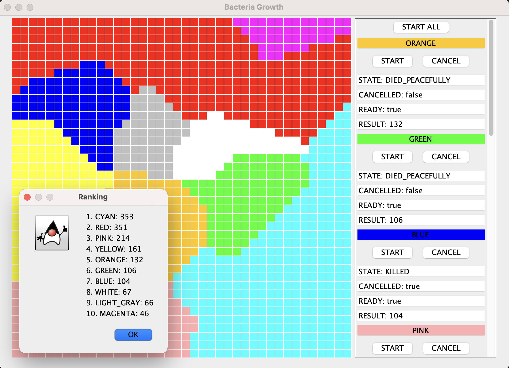

# Bacteria Growth Simulation
> Application enables to simulate the spread of bacteria on the petri dish using multithreading programming. Functionality for managing each bacterium is provided.

<!-- Include demo here -->

## Table of Contents
* [General Info](#general-information)
* [Technologies Used](#technologies-used)
* [Features](#features)
* [Screenshots](#screenshots)
* [Setup](#setup)
* [Project Status](#project-status)
* [Room for Improvement](#room-for-improvement)
* [Contact](#contact)


## General Information
- This application provides a simple and engaging way to simulate bacterial growth on a petri dish. Each bacterium has a unique growth rate and competes to occupy as much space as possible.
- Users can interact with individual bacteria by activating or stopping their growth. The number and types of bacteria are customizable.
- This project can be used as an educational tool to spark curiosity about biological processes in a fun and interactive way.
- I created this project to deepen my understanding of multithreading and thread management in **Java**, using **ExecutorService** and **FutureTask**.

## Technologies Used
- **Java** - version 17
- **Multithreading** (incl. ExecutorService & FutureTask)
- **Swing**
- **Object-Oriented Programming** (OOP)

## Features
- Bacteria growth stimulation
- User customization
- Internationalization - polish and english
- Multithreading implementation
- Thread safety


## Screenshots



## Setup
1. **Clone the repository and change directory**
   ```bash
   git clone https://github.com/SailNCode/bacteria-growth-simulation.git
   
   cd bacteria-growth-simulation
   ```
2. **Compile .java files into bin/**
   ```bash
   javac -d bin src/*.java  src/bacterium/*.java src/internationalization/*.java src/pres/*.java
   ```
3. **Copy contents of resources/ into bin/**
   ```bash
   cp -r resources bin/
   ```
4. **Create .jar**
   ```bash
   jar cfm Bacteria.jar manifest.txt -C bin .
   ```
5. **Run the application:**
   ```bash
   java -jar Bacteria.jar
   ```

## Project Status
Project is: _complete_


## Room for Improvement

- Introduce antibiotic to cease the bacteria growth.
- Introduce the identification of bacteria by ids instead of colors. Which enables bacteria of multiple colors on the board.


## Contact
Created by [SailNCode](https://github.com/SailNCode) - feel free to contact me!
